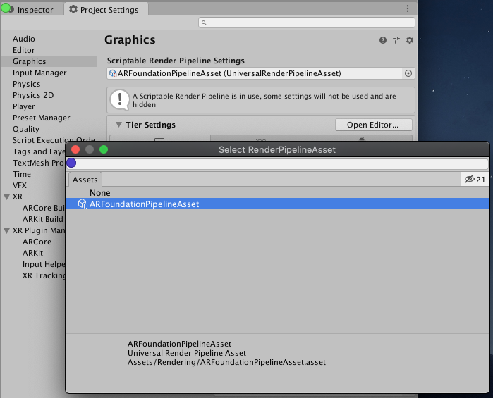

# Configuring the AR Camera background using a Scriptable Render Pipeline

AR Foundation supports the Universal Render Pipeline (URP) versions 7.0.0 or later. See the [URP Install and Configure documentation](https://docs.unity3d.com/Packages/com.unity.render-pipelines.universal@latest?subfolder=/manual/InstallingAndConfiguringURP.html) for more details on switching to URP.

> [!NOTE]
> Projects made using URP are not compatible with the High Definition Render Pipeline or the built-in Unity rendering pipeline. Before you start development, you must decide which render pipeline to use in your project.

## Basic URP configuration for AR Foundation

### Set up URP Render Pipeline asset

> [!NOTE]
> The following basic steps for URP setup are not specific to AR Foundation and are included to indicate how to convert a legacy AR Foundation project into a URP AR Foundation project. If your project was created from the [URP Project Template](https://docs.unity3d.com/Packages/com.unity.render-pipelines.universal@7.1/manual/creating-a-new-project-with-urp.html) or you already have a `UniversalRenderPipelineAsset` and `Pipeline Asset (Forward Renderer)` in your project, [skip to the next section](#configuring-urp-to-work-with-arfoundation).

To use the Universal Rendering Pipeline, you must create a `Pipeline Asset`. Follow these steps:

1. In the project's `Assets` folder, create a new folder named `Rendering`.
2. In the `Rendering` folder, create a Pipeline Asset (Forward Renderer) for URP:
    Right-click anywhere in the folder and select **Create** &gt; **Rendering** &gt; **Universal Render Pipeline** &gt; **Pipeline Asset (Forward Renderer)** from the context menu.
    This creates two assets:
    * A [UniversalRenderPipelineAsset](https://docs.unity3d.com/Packages/com.unity.render-pipelines.universal@latest?subfolder=/api/UnityEngine.Rendering.Universal.UniversalRenderPipelineAsset.html)
    * A [ForwardRenderer](https://docs.unity3d.com/Packages/com.unity.render-pipelines.universal@latest?subfolder=/api/UnityEngine.Rendering.Universal.ForwardRenderer.html)

### Configuring URP to work with ARFoundation

> [!NOTE]
> URP provides a pipeline conversion tool that builds a series of assets and pipelines to mimic the built-in Legacy rendered. If you wish to use this tool you must either do it before assigning the `ARBackgroundRenderFeature` to a renderer or make sure you go back and set the proper URP Render Pipeline Asset as your Render Pipeline Asset.

After you created a `Pipeline Asset`, you can configure the asset to work with AR Foundation. Follow these steps:

1. Locate your `Forward Renderer` asset. If you created your project from the [URP Project Template](https://docs.unity3d.com/Packages/com.unity.render-pipelines.universal@7.1/manual/creating-a-new-project-with-urp.html), this is located in the `Settings` folder in your project's `Assets` folder.
2. Select your `Forward Renderer` asset. In its Inspector, add an `ARBackgroundRendererFeature` to the list of Renderer Features.
   
3. Access the Graphics section of the Project Settings window (menu: **Edit** &gt; **Project Settings**, then select **Graphics**), and select the `UniversalRenderPipelineAsset` in the **Scriptable Render Pipeline Settings** field.
   
