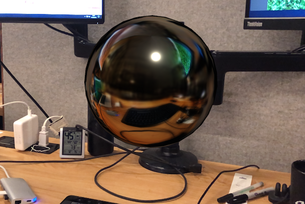

# XR environment probe subsystem

The environment probe subsystem provides an interface for managing and interacting with XR environment probes.

Environment probes capture real-world imagery from a camera and organize that information into an environment texture, such as a cube map, that contains the view in all directions from a certain point in the scene. Rendering 3D objects with this environment texture allows for real-world imagery to be reflected in the rendered objects. The result is generally realistic reflections and lighting of virtual objects, as influenced by the real-world view, which enhances the appearance of rendered objects and allows them to better match the real-world environment.

The following image illustrates the use of the environment texture from an environment probe applied to a sphere as a reflection map.

## Environment probes

Environment probes can be placed at a real-world location to capture environment texturing information. Each environment probe has a scale, orientation, position, and bounding volume size.

The scale, orientation, and position properties define the environment probe's transformation relative to the XR origin.

The bounding size defines the volume around the environment probe's position. An infinite bounding size indicates that the environment texture can be used for global lighting. A finite bounding size indicates that the environment texture captures the local lighting conditions in a specific area surrounding the probe.

Environment probes can be placed in two different ways:

- Manual placement

  Environment probes are manually placed in the scene. If you want to capture the most accurate environment information for a specific virtual object, place the probe close to the location of that object. This increases the quality of the rendered object. If a virtual object is moving and you know the path of that movement, you can place multiple environment probes along the path so the rendered object can better reflect the virtual object's movement through the real-world environment.

- Automatic placement

  Provider implementations can implement their own algorithms to choose how and where to place environment probes for the best-quality environment information. Automatic probe placement usually relies on key feature points detected in the real-world environment. The provider implementation is in full control of these automatic placement choices.

Automatically placed environment probes offer a good overall set of environment information for real-world features. However, manually placing environment probes close to key virtual scene objects allows for a better environmental rendering quality of those objects.
